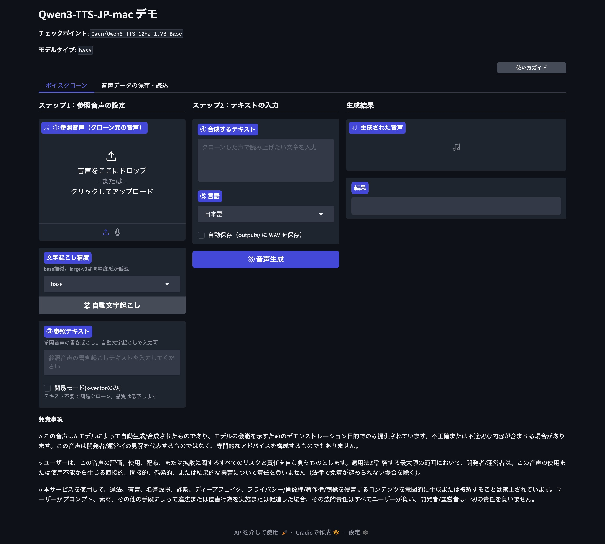

# Qwen3-TTS-JP-mac

**macOS Apple Silicon ネイティブ対応** の Qwen3-TTS 日本語ローカライズ版フォークです。

## はじめに

[Qwen3-TTS](https://github.com/QwenLM/Qwen3-TTS) は Alibaba Qwen チームが開発した多言語テキスト音声合成 (TTS) モデルです。オリジナルは Linux/CUDA 環境を前提に開発されており、推奨される [FlashAttention 2](https://github.com/Dao-AILab/flash-attention) は macOS では動作しません。

本フォークは **Docker や仮想マシンを使わずに、macOS Apple Silicon (M1/M2/M3/M4) 上で Qwen3-TTS を直接動作** させるための対応を行っています。また、Windows 対応フォーク [Qwen3-TTS-JP](https://github.com/hiroki-abe-58/Qwen3-TTS-JP) を参考に、GUI の日本語化、Whisper 統合、devbox によるセットアップ自動化を独自に実装しています。

<p align="center">
  
</p>

## 特徴

### macOS Apple Silicon ネイティブ対応

- **FlashAttention 2 不要** — macOS で動作しない FA2 の代わりに SDPA (Scaled Dot-Product Attention) を自動選択
- **Docker / VM 不要** — macOS 上で直接実行
- **MPS バックエンド** — Apple GPU によるアクセラレーション（未サポート操作は CPU に自動フォールバック）
- **自動デバイス検出** — MPS > CUDA > CPU の優先順で自動選択
- **SoX はシステム依存** — devbox または Homebrew でインストール（Python パッケージとしては不要）

### 日本語ローカライズ & 機能拡張

- **GUI 完全日本語化** — Gradio デモ UI のすべてのラベル・ボタン・説明を日本語化
- **Whisper 自動文字起こし** — ボイスクローン用の参照テキストをワンクリックで自動生成
  - 対応モデル: `tiny` (39M), `base` (74M), `small` (244M), `medium` (769M), `large-v3` (1550M)
- **使い方ガイド** — Driver.js によるインタラクティブなオンボーディングツアー
- **音声自動保存** — 生成した音声を `outputs/` ディレクトリに WAV 形式で自動保存（オプション）
- **10言語対応** — 中国語, 英語, 日本語, 韓国語, ドイツ語, フランス語, ロシア語, ポルトガル語, スペイン語, イタリア語

### 3つの音声生成モード

| モード | モデル | 説明 |
|---|---|---|
| **CustomVoice** | `Qwen3-TTS-12Hz-1.7B-CustomVoice` | 9種類のプレミアム音声 + 指示による制御 |
| **VoiceDesign** | `Qwen3-TTS-12Hz-1.7B-VoiceDesign` | 自然言語の説明から音声を生成 |
| **VoiceClone** | `Qwen3-TTS-12Hz-1.7B-Base` | 3秒の音声サンプルから話者をクローン |

## 動作環境

- **OS**: macOS 14 (Sonoma) 以降
- **チップ**: Apple Silicon (M1 / M2 / M3 / M4)
- **Python**: 3.12 以上
- **メモリ**: 16GB 以上推奨（1.7B モデル使用時）
- **ストレージ**: モデルごとに約 3〜7GB

## インストール

### 1. リポジトリのクローン

```bash
git clone https://github.com/shiroemons/Qwen3-TTS-JP-mac.git
cd Qwen3-TTS-JP-mac
```

### 2. セットアップ

#### オプション A: devbox を使う（推奨）

```bash
# devbox のインストール（未導入の場合）
curl -fsSL https://get.jetify.com/devbox | bash

# セットアップ（Python 環境 + 依存関係 + Whisper を一括インストール）
devbox install
devbox run setup
```

#### オプション B: セットアップスクリプト

```bash
bash setup_mac.sh
```

#### オプション C: 手動セットアップ (uv)

```bash
# 前提: uv, sox, ffmpeg がインストール済み
# brew install uv sox ffmpeg

uv sync --extra whisper
```

### 3. 動作確認

```bash
# PyTorch の MPS サポートを確認
devbox run check-mps
# → MPS: True

# デバイス自動検出を確認
devbox run check-device
# → Device: mps
```

devbox を使わない場合:

```bash
uv run python -c "import torch; print(f'MPS: {torch.backends.mps.is_available()}')"
# → MPS: True

uv run python -c "from qwen_tts.utils.device import detect_device; print(f'Device: {detect_device()}')"
# → Device: mps
```

## 使用方法

> **Note:** モデルは初回実行時に HuggingFace から自動ダウンロードされます（1モデルあたり約 3〜7GB）。初回は時間がかかる場合があります。

### GUI の起動

コマンドラインから:

```bash
uv run qwen-tts-demo Qwen/Qwen3-TTS-12Hz-1.7B-CustomVoice
uv run qwen-tts-demo Qwen/Qwen3-TTS-12Hz-1.7B-VoiceDesign
uv run qwen-tts-demo Qwen/Qwen3-TTS-12Hz-1.7B-Base

# オプション指定
uv run qwen-tts-demo Qwen/Qwen3-TTS-12Hz-1.7B-CustomVoice \
  --ip 127.0.0.1 --port 8000 --device auto --dtype auto
```

devbox 環境の場合:

```bash
devbox run demo:custom    # CustomVoice
devbox run demo:design    # VoiceDesign
devbox run demo:clone     # VoiceClone (Base)
```

ブラウザで `http://localhost:8000` を開いてください。

**Web UI の機能:**

- **自動保存** — 「自動保存」チェックボックスを ON にすると、生成した音声が `outputs/` ディレクトリに WAV 形式で自動保存されます
- **使い方ガイド** — 「使い方」ボタンをクリックすると、各機能を順番に案内するインタラクティブツアーが起動します

### ボイスクローンの手順

ボイスクローン（Base モデル）で音声を複製する手順:

1. **モデルの起動** — `devbox run demo:clone` または `uv run qwen-tts-demo Qwen/Qwen3-TTS-12Hz-1.7B-Base` で VoiceClone デモを起動
2. **参照音声のアップロード** — 「ボイスクローン」タブで参照音声ファイル（WAV/MP3/FLAC）をアップロード（3秒程度の明瞭な音声が最適）
3. **参照テキストの入力** — 参照音声の内容を「参照テキスト」欄に入力。Whisper がインストール済みの場合は「自動文字起こし」ボタンで自動入力可能
4. **合成テキストの入力** — 生成したいテキストを入力
5. **言語の選択** — ドロップダウンから対象言語を選択
6. **音声の生成** — 「音声を生成」ボタンをクリック
7. **保存** — 生成された音声をダウンロード、または「音声データの保存・読込」タブでプリセットとして保存

### macOS ネイティブ対応のポイント

| 課題 | オリジナル (Linux/CUDA) | 本フォーク (macOS/MPS) |
|---|---|---|
| Attention 実装 | FlashAttention 2 推奨 | SDPA を自動選択 |
| GPU バックエンド | CUDA | MPS（未サポート操作は CPU フォールバック） |
| データ型 | bfloat16 | float32（MPS の bfloat16 制限のため） |
| SoX | pip パッケージ | システム依存（brew / devbox） |
| 環境構築 | pip / conda | devbox + uv |

<details>
<summary>Python API</summary>

#### CustomVoice

```python
import soundfile as sf
from qwen_tts import Qwen3TTSModel
from qwen_tts.utils.device import detect_device, detect_dtype, detect_attn_implementation, setup_mps_env

setup_mps_env()
device = detect_device()

model = Qwen3TTSModel.from_pretrained(
    "Qwen/Qwen3-TTS-12Hz-1.7B-CustomVoice",
    device_map=device,
    dtype=detect_dtype(device),
    attn_implementation=detect_attn_implementation(device),
)

wavs, sr = model.generate_custom_voice(
    text="こんにちは、音声合成のテストです。",
    language="Japanese",
    speaker="Ono_Anna",
)
sf.write("output.wav", wavs[0], sr)
```

#### VoiceDesign

```python
import soundfile as sf
from qwen_tts import Qwen3TTSModel
from qwen_tts.utils.device import detect_device, detect_dtype, detect_attn_implementation, setup_mps_env

setup_mps_env()
device = detect_device()

model = Qwen3TTSModel.from_pretrained(
    "Qwen/Qwen3-TTS-12Hz-1.7B-VoiceDesign",
    device_map=device,
    dtype=detect_dtype(device),
    attn_implementation=detect_attn_implementation(device),
)

wavs, sr = model.generate_voice_design(
    text="今日はいい天気ですね。",
    language="Japanese",
    instruct="明るく元気な若い女性の声で話してください。",
)
sf.write("output_design.wav", wavs[0], sr)
```

#### VoiceClone

```python
import soundfile as sf
from qwen_tts import Qwen3TTSModel
from qwen_tts.utils.device import detect_device, detect_dtype, detect_attn_implementation, setup_mps_env

setup_mps_env()
device = detect_device()

model = Qwen3TTSModel.from_pretrained(
    "Qwen/Qwen3-TTS-12Hz-1.7B-Base",
    device_map=device,
    dtype=detect_dtype(device),
    attn_implementation=detect_attn_implementation(device),
)

wavs, sr = model.generate_voice_clone(
    text="合成したいテキストをここに入力します。",
    language="Japanese",
    ref_audio="reference.wav",
    ref_text="参照音声のテキスト",
)
sf.write("output_clone.wav", wavs[0], sr)
```

</details>

## Whisper 自動文字起こし

VoiceClone モードでは、参照音声のテキストが必要です。「ボイスクローン」タブの「自動文字起こし」ボタンで参照テキストを自動生成できます。

```bash
# Whisper サポートをインストール
uv sync --extra whisper
```

対応モデル: `tiny`, `base`, `small`, `medium`, `large-v3`

> **Note:** faster-whisper は MPS 非対応のため CPU で動作します。Whisper が未インストールの場合、文字起こし UI は自動的に非表示になります。

## macOS 環境構築の詳細

### 解決した技術的課題

#### 1. FlashAttention 2 の macOS 非対応

**問題:** Qwen3-TTS は推論時に FlashAttention 2 を推奨していますが、FA2 は CUDA 専用であり macOS では動作しません。

**解決策:** デバイスに応じて Attention 実装を自動選択する仕組みを導入しました。

| デバイス | Attention 実装 | 選択理由 |
|---|---|---|
| CUDA | FlashAttention 2 | 最高速（オリジナル推奨） |
| MPS | SDPA | FA2 非対応、PyTorch 標準で安定動作 |
| CPU | SDPA | FA2 非対応 |

```python
from qwen_tts.utils.device import detect_attn_implementation
attn = detect_attn_implementation("mps")  # → "sdpa"
```

#### 2. MPS バックエンドの制限

**問題:** Apple の MPS バックエンドは一部の PyTorch 操作をサポートしていないため、実行時にエラーが発生します。

**解決策:** 環境変数 `PYTORCH_ENABLE_MPS_FALLBACK=1` を設定し、未サポート操作を CPU に自動フォールバックさせます。devbox 環境では自動的に設定されます。

```
# 以下の警告は正常です:
UserWarning: MPS: no support for ... falling back to CPU
```

#### 3. VoiceClone の dtype 制限

**問題:** MPS バックエンドでは bfloat16 のサポートが不完全で、VoiceClone の推論時にエラーが発生します。

**解決策:** デバイスに応じて dtype を自動選択します。

```python
from qwen_tts.utils.device import detect_dtype
dtype = detect_dtype("mps")   # → torch.float32
dtype = detect_dtype("cuda")  # → torch.bfloat16
```

#### 4. SoX 依存の解決

**問題:** オリジナルの Qwen3-TTS は Python パッケージとして SoX を依存に含んでいますが、macOS では正しくインストールできない場合があります。

**解決策:** SoX を Python 依存関係から除外し、システムパッケージとして管理します。

```bash
brew install sox        # Homebrew
# または devbox に含まれています
```

#### 5. onnxruntime の MPS 非対応

**問題:** onnxruntime は MPS ExecutionProvider をサポートしていません。

**解決策:** CPUExecutionProvider で動作するため、特別な変更は不要です。音声トークナイザーの処理は CPU 上で実行されます。

### トラブルシューティング

| 症状 | 原因 | 解決策 |
|---|---|---|
| `MPS backend out of memory` | GPU メモリ不足 | 0.6B モデルに切り替え / 他のアプリを閉じる |
| `MPS: no support for ...` 警告 | MPS 未サポート操作 | 正常動作（CPU フォールバック） |
| `FlashAttention is not available` | macOS 非対応 | 自動的に SDPA を使用（対応不要） |
| `sox` が見つからない | 未インストール | `brew install sox` または devbox を使用 |
| モデルダウンロードが遅い | ネットワーク | `huggingface-cli` で事前ダウンロード |

### モデルの手動ダウンロード

モデルは初回実行時に自動ダウンロードされますが、事前に手動でダウンロードすることもできます。

```bash
# 推論モデル
uv run huggingface-cli download Qwen/Qwen3-TTS-12Hz-1.7B-CustomVoice
uv run huggingface-cli download Qwen/Qwen3-TTS-12Hz-1.7B-VoiceDesign
uv run huggingface-cli download Qwen/Qwen3-TTS-12Hz-1.7B-Base

# 音声トークナイザー
uv run huggingface-cli download Qwen/Qwen3-TTS-Tokenizer-12Hz

# 軽量版 (0.6B)
uv run huggingface-cli download Qwen/Qwen3-TTS-12Hz-0.6B-CustomVoice
uv run huggingface-cli download Qwen/Qwen3-TTS-12Hz-0.6B-VoiceDesign
uv run huggingface-cli download Qwen/Qwen3-TTS-12Hz-0.6B-Base
```

## 開発

### ホットリロード開発モード

UI の変更をリアルタイムで確認しながら開発できます。モデルは初回起動時に1回だけ読み込まれ、`qwen_tts/` 配下の `.py` ファイルの変更がブラウザに即座に反映されます。

```bash
devbox run dev:custom    # CustomVoice ホットリロード
devbox run dev:design    # VoiceDesign ホットリロード
devbox run dev:clone     # VoiceClone ホットリロード
```

## Fine-tuning

macOS (MPS) での Fine-tuning は**実験的**です。

```bash
# データ準備
uv run python finetuning/prepare_data.py \
  --device auto \
  --input_jsonl train_raw.jsonl \
  --output_jsonl train_with_codes.jsonl

# SFT 実行
uv run python finetuning/sft_12hz.py \
  --device auto \
  --no-flash-attn \
  --train_jsonl train_with_codes.jsonl \
  --batch_size 2 --lr 2e-6 --num_epochs 3
```

> **Warning:** MPS では mixed precision (bf16) が無効になるため、トレーニングは CUDA 環境と比べて大幅に遅くなります。本番のトレーニングには CUDA 環境を推奨します。

## 元プロジェクトとの差分

| 変更点 | 詳細 |
|---|---|
| デバイス自動検出 | `qwen_tts/utils/device.py` — MPS > CUDA > CPU |
| FlashAttention → SDPA | macOS では自動的に SDPA を使用 |
| 日本語 GUI | Gradio デモの全 UI を日本語化 |
| Whisper 統合 | `faster-whisper` によるオプション文字起こし |
| 開発環境 | devbox + uv によるセットアップ自動化 |
| 使い方ガイド | Driver.js によるインタラクティブツアー |
| 音声自動保存 | 生成音声の `outputs/` 自動保存機能 |
| ホットリロード | Gradio dev モードによる高速 UI 開発 |
| sox 依存 | Python パッケージから除外（システム依存として管理） |

## ライセンス

Apache License 2.0 — 詳細は [LICENSE](LICENSE) を参照してください。

本プロジェクトは以下のオープンソースソフトウェアを使用しています:

| ソフトウェア | ライセンス | 用途 |
|---|---|---|
| [Qwen3-TTS](https://github.com/QwenLM/Qwen3-TTS) | Apache 2.0 | TTS モデル本体（オリジナル） |
| [Qwen3-TTS-JP](https://github.com/hiroki-abe-58/Qwen3-TTS-JP) | Apache 2.0 | Windows 対応・日本語ローカライズ（参考） |
| [faster-whisper](https://github.com/SYSTRAN/faster-whisper) | MIT | 音声文字起こし（オプション依存） |
| [OpenAI Whisper](https://github.com/openai/whisper) | MIT | Whisper モデル |

詳細は [NOTICE](NOTICE) を参照してください。

## 免責事項

### 音声生成に関する免責

この音声はAIモデルによって自動生成/合成されたものであり、モデルの機能を示すためのデモンストレーション目的でのみ提供されています。不正確または不適切な内容が含まれる場合があります。この音声は開発者/運営者の見解を代表するものではなく、専門的なアドバイスを構成するものでもありません。

### ボイスクローンに関する警告

音声クローン機能を使用する際は、対象者の**肖像権・パブリシティ権**に十分ご注意ください。必ず**本人の同意を得た上**で使用してください。他者の声を無断で複製し、詐欺・なりすまし・名誉毀損・ディープフェイクなどの目的で使用することは**固く禁じられています**。

### 法的責任

ユーザーは、この音声の評価、使用、配布、または拡散に関するすべてのリスクと責任を自ら負うものとします。適用法が許容する最大限の範囲において、開発者/運営者は、この音声の使用または使用不能から生じる直接的、間接的、偶発的、または結果的な損害について責任を負いません。本ソフトウェアは**現状のまま (AS IS)** 提供されています。

## 謝辞

- [Qwen3-TTS](https://github.com/QwenLM/Qwen3-TTS) — Alibaba Qwen Team（オリジナル TTS モデル）
- [Qwen3-TTS-JP](https://github.com/hiroki-abe-58/Qwen3-TTS-JP) — hiroki-abe-58（Windows 対応・日本語ローカライズ）
- [faster-whisper](https://github.com/SYSTRAN/faster-whisper) — SYSTRAN（高速 Whisper 推論）

## 引用

本プロジェクトは Qwen3-TTS をベースにしています。学術目的で使用する場合は、オリジナルの論文を引用してください:

```bibtex
@article{qwen3tts,
  title={Qwen3-TTS Technical Report},
  author={Qwen Team},
  year={2025},
  url={https://github.com/QwenLM/Qwen3-TTS}
}
```
